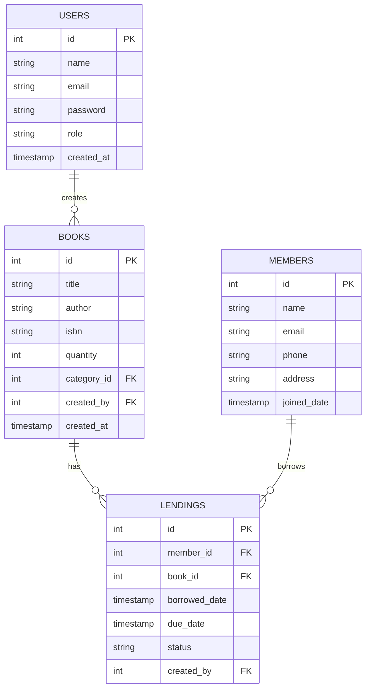

# Digital Library Dashboard

A digital library management system built with Go Fiber and PostgreSQL.

## Features
- JWT Authentication & Authorization
- Book Management (CRUD)
- Member Management
- Lending Record Management
- Analytics Dashboard
- Swagger API Documentation

## Tech Stack
- Golang 1.21+
- Fiber v2 (Web Framework)
- PostgreSQL 15+
- JWT for Authentication
- Swagger/OpenAPI for API Documentation
- Goose for Database Migrations

## Database Schema


## API Endpoints

### Authentication
- POST `/api/register` - Register new user
- POST `/api/login` - Login user

### Books
- GET `/api/books` - List all books
- GET `/api/books/:id` - Get book by ID
- POST `/api/books` - Create new book
- PUT `/api/books/:id` - Update book
- DELETE `/api/books/:id` - Delete book

### Members
- GET `/api/members` - List all members
- GET `/api/members/:id` - Get member by ID
- POST `/api/members` - Create new member

### Lending
- GET `/api/lendings` - List all lending records
- GET `/api/lendings/:id` - Get lending by ID
- POST `/api/lendings` - Create new lending
- PUT `/api/lendings/:id` - Update lending status

## Setup Instructions

1. Clone repository
```bash
git clone https://github.com/RamdhaniMichan/Digital-Library-Analytics-Dashboard
cd Digital-Library-Analytics-Dashboard
```

2. Install dependencies
```bash
go mod download
```

3. Setup environment variables
```bash
cp .env.example .env
# Edit .env with your database credentials
```

4. Run database migrations
```bash
goose postgres "host=localhost port=5432 user=postgres password=postgres dbname=digital_library sslmode=disable" up
```

5. Run the application
```bash
go run cmd/main.go
```

6. Access API documentation
```
http://localhost:8081/swagger/
```

## API Usage Examples

### Register User
```bash
curl -X POST http://localhost:8081/api/register \
  -H "Content-Type: application/json" \
  -d '{
    "name": "Admin User",
    "email": "admin@example.com",
    "password": "secret123",
    "role": "admin"
  }'
```

### Login
```bash
curl -X POST http://localhost:8081/api/login \
  -H "Content-Type: application/json" \
  -d '{
    "email": "admin@example.com",
    "password": "secret123"
  }'
```

### Create Book (Requires JWT)
```bash
curl -X POST http://localhost:8081/api/books \
  -H "Content-Type: application/json" \
  -H "Authorization: Bearer <your_jwt_token>" \
  -d '{
    "title": "The Go Programming Language",
    "author": "Alan A. A. Donovan",
    "isbn": "978-0134190440",
    "quantity": 5
  }'
```

## Development

### Project Structure
```
.
├── cmd/
│   └── main.go
├── internal/
│   ├── book/
│   ├── member/
│   ├── lending/
│   ├── user/
│   └── middleware/
├── pkg/
│   └── utils/
├── migrations/
└── docs/
```